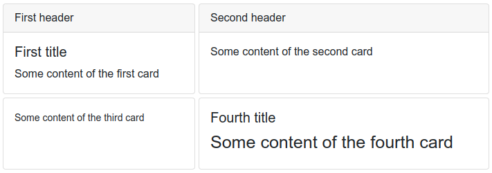

# Custom components

KVision can be easily extended by building custom components. Generally there are two ways of creating reusable components:

* extending KVision DSL to easily declare functional, stateless components
* extending KVision classes by inheritance to build full-featured, statefull components

Let's make an example of a Bootstrap card component using both ways.

## Extending KVision DSL

To create a new component you just need to create an extension function on the `Container` interface. You can use any parameters to describe your component look and behavior. It's recommended to use default values for parameters and use the last one for content builder.&#x20;

```kotlin
fun Container.card(header: String? = null, title: String? = null, contentBuilder: P.() -> Unit) {
    div(className = "card") {
        if (header != null) {
            div(header, className = "card-header")
        }
        div(className = "card-body") {
            if (title != null) {
                h5(title, className = "card-title")
            }
            p(className = "card-text", init = contentBuilder)
        }
    }
}
```

Now you can use your DSL component very easily just by calling the function with appropriate parameters.

```kotlin
gridPanel(templateColumns = "auto auto", columnGap = 5, rowGap = 5) {
    card("First header", "First title") {
        +"Some content of the first card"
    }
    card("Second header") {
        +"Some content of the second card"
    }
    card {
        small("Some content of the third card")
    }
    card(title = "Fourth title") {
        h3("Some content of the fourth card")
    }
}
```

You will get this result:



## Extending KVision classes

Most KVision classes are declared as open so you can use all object-oriented techniques to extend KVision component hierarchy and build your own classes. For creating general UI components you should probably inherit from the `SimplePanel` container. First let's re-create our card component with inheritance.

```kotlin
  class Card(
    header: String? = null,
    title: String? = null,
    contentBuilder: P.() -> Unit
) : SimplePanel("card") {

    init {
        if (header != null) {
            div(header, className = "card-header")
        }
        div(className = "card-body") {
            if (title != null) {
                h5(title, className = "card-title")
            }
            p(className = "card-text", init = contentBuilder)
        }
    }
}
```

The code looks a bit similar, but this time we can do a lot more because our component can have it's own state. Let's add an example `centered` property. We will use methods inherited from KVision framework to make our property fully interactive.

```kotlin
class Card(
    header: String? = null,
    title: String? = null,
    centered: Boolean = false,
    contentBuilder: P.() -> Unit
) : SimplePanel("card") {

    var centered by refreshOnUpdate(centered)

    init {
        if (header != null) {
            div(header, className = "card-header")
        }
        div(className = "card-body") {
            if (title != null) {
                h5(title, className = "card-title")
            }
            p(className = "card-text", init = contentBuilder)
        }
    }

    override fun buildClassSet(classSetBuilder: ClassSetBuilder) {
        super.buildClassSet(classSetBuilder)
        if (centered) {
            classSetBuilder.add("text-center")
        }
    }
}
```

By using `refreshOnUpdate()` delegate method and overriding `buildClassSet()` method we make sure our component will re-render itself with appropriate CSS class name, when the property value is changed.

We can now use our new component by creating new instances and adding them to the components tree. We can easily automate our code.

```kotlin
val listOfCards = List(3) { // generate three cards
    val index = it + 1
    Card("Header $index", "Title $index", centered = it % 2 == 0) {
        +"Some content of the card $index"
    }
}

gridPanel(columnGap = 5, rowGap = 5) { // put them on the diagonal of the grid
    listOfCards.forEachIndexed { index, card -> add(card, index + 1, index + 1) }
}

button("Toggle centered").onClick { // We can easily interact with our cards
    listOfCards.forEach { it.centered = !it.centered }
}
```

You will get this result:


The components created by inheritance can also be used with KVision DSL. You just need to provide an appropriate extension function.

```kotlin
 fun Container.card(
    header: String? = null,
    title: String? = null,
    centered: Boolean = false,
    content: P.() -> Unit
): Card {
    return Card(header, title, centered, content).also { add(it) }
}
```
